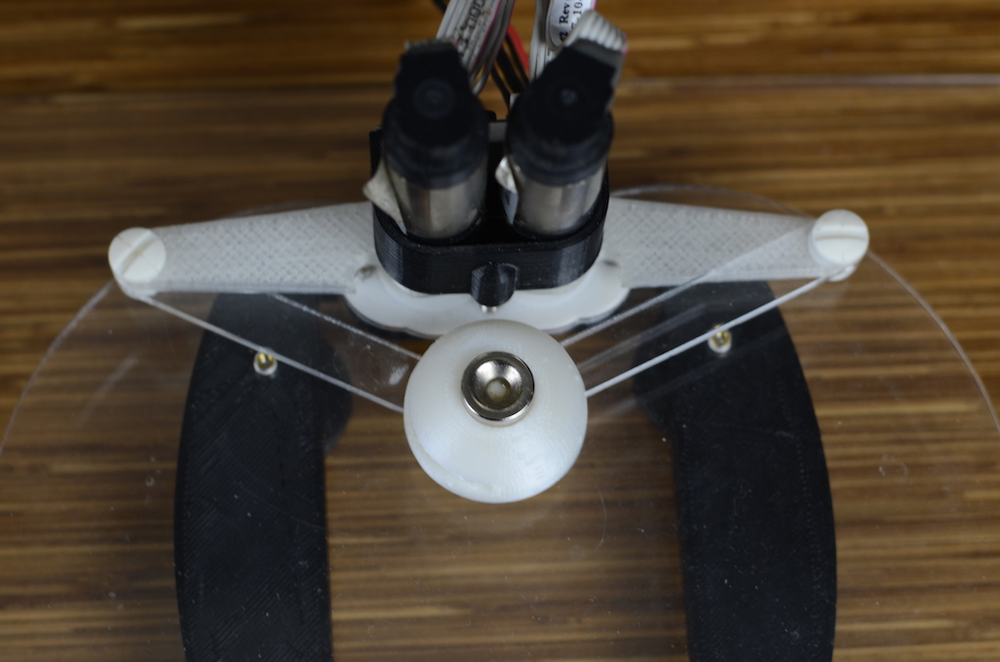

# Hello Wall

You've assembled the hardware of your Haplet, you've setup the Arduino IDE, and you've downloaded Processing. Great job!

Strap in, now it gets to the fun stuff; we're going to take you step by step through your first haptic demo. After completing these you'll know how to download the demos we have in our other repositories, and even begin to make your own demos.

We'll go through the following steps -
1. Quick intro to Processing
2. Opening and running Hello Wall
3. Explaining some key code

## What is Processing?

We at Haply use Processing as a tool for creating Haptic demos, as it has great visualization capabilities and plugs in extremely well to our tools. Beyond this application, there is a strong community of visual artists who use Processing. Have a look at https://www.openprocessing.org/ to see some great Open-Source creations that have been made using Processing as a framework. This can serve as inspirations for ideas of demos to create - the advantage of using Haply tools to create these types of demos is the ability to integrate haptics and physics engine!

## Setting up the Sketch
Running any sketch using Processing is easy, there are just a few things to ensure are taken care of.  
1. Navigate to the Hello Wall folder, and open the Hello_Wall.pde file. The file format used by Processing is .pde.

2. After a quick splash screen,  you'll see the Processing sketch! This contains all the code that is used in the environment you'll be running soon.

3. In order for Processing to communicate with the Haply board, we need to ensure the correct COM (communication) port is assigned. To do this, scroll down in the sketch to line 104. You'll see the following line -

``haplyBoard = new Board(this, Serial.list()[0], 0);``

This line is assigning the 0th item on the list created by ``Serial.list`` as the communication port through which Processing interacts with the Haply board. Odds are, the 0th item is not the correct port so we'll need to find the correct port - we'll have to edit the ``[0]`` to become the correct port assignment.

Notice that on line 108 the following line is written -  
``  println(Serial.list());``  

This statement, ``println`` tells Processing to print whatever is in the brackets to the output console. In this case, we're printing the list of all possible COM ports.

4. Run the sketch, and even though the environment won't be created you'll get an output in your console from the ``println`` command. When I run this code, I get this -  
``/dev/cu.Bluetooth-Incoming-Port /dev/cu.RoavF2_4083-SerialPortS /dev/cu.usbmodem14201``

Any of these look familiar? The final item in the list matches the format of what we'd expect a USB port to look like, which my Haply board is plugged into. Similar to Arduino, depending on your OS you'll get a different format.  
Windows: "COM10"  
Linux: "/dev/ttyUSB0"  
Mac: "/dev/cu.usbmodem1411"  

5. Because the port I want is the __3rd__ item on the list, I need to change the digit in COM port assignment to a __2__ (don't forget computers start counting at 0).

6. Once this assignment switch is made, it's in the code and as long as I'm working in this sketch the Haply board can communicate with Processing easily.

## Running the Sketch
Once I have my COM port assignment complete, there's one small step and we're good to go!

Each time a Processing sketch is run, Processing will take a look at where the Haplet's end effector is and take that as the initial position. So that the position of the end effector matches where the avatar (the in-screen object controlled by the Haplet) is in the sketch, I need to make sure that the initial position of my end effector in the real world is where it should be - right in the middle.

Ensure that the end effector is in this position each time you run you're sketch, and you'll be all set to run your first haptic demo!

## Explaining Some Code
To find documentation on what the code in the sketch is doing, we recommend two resources-

1. [Haply API documentation](https://haphub.github.io/hAPI_Fisica/annotated.html) - Documentation relating to the physics engine. All functions for creating and editing objects and haptic effects can be found here.
2. [Processing Reference Library](https://processing.org/reference/) - All functions that are native to Processing. These aren't for haptic effects, but functions for embedding images or creating graphical objects such as text can be found here.

To finalize the introduction to using the Java Haply API, we'll explain how the wall was created in the Hello Wall demo.

#### General Processing Structure
In it's most basic form, a Processing sketch consists of two functions: ``setup()`` and ``draw()``. ``setup()`` runs once and is where all objects in an environment are initially declared and placed, and ``draw()`` runs in a loop. ``draw()`` is where we update our simulation frame by frame, and in more advanced sketches it is where we place event timers and triggers. You'll see examples of these sketches in later demos, but for now we'll be mostly focusing on how to create objects in the ``setup()`` function.

#### The Wall in Hello Wall
A wall in two dimensions is a box. Thats the type of object used to create wall in this demo. We'll be creating an FBox object, and then assigning it characteristics matching how a wall is supposed to behave in the environment. Documentation for creating boxes using the Haply API can be found [here](https://haphub.github.io/hAPI_Fisica/class_f_box.html).  

On line 79 of the sketch, we declare an object named ``wall`` and assign it the type ``FBox``. This is done before ``setup()`` runs, and creates space in memory for us to further define our wall.

In ``setup()`` line 126 we follow the FBox documentation (linked above) to create our wall.  
``wall = new FBox(7,1);`` Creates the wall and defines it as having length 7 and height 1.  
``wall.setPosition(worldWidth/2, worldHeight/2);`` Defines the initial position the exact middle of the environment. Note that ``worldWidth`` and ``worldHeight`` are defined on line 67.  
``wall.setFill(0,0,0);``  Colors the wall to black (0,0,0) denotes the absence of any color, which is black.  
``wall.setStatic(true);`` Defines the wall as static, meaning that it will not move.  
``world.add(wall);`` Adds the wall to the world object; without this the wall will not appear in the sketch.  

The code above edits attributes which have default values as defined in the documentation. To see these values, click on the drop box under "Protected Attributes" in the documentation. Feel free to experiment with these values and see how they change the properties of the FBox! You'll also find documentation on each function, with correct syntax as well as with which objects they can be used.
