# Haply Software Setup
## Arduino Installation

### Installing the Arduino IDE

This manual provides a step-by-step guide on installing the Arduino IDE,
setting up the ARM based microcontroller core support for the Arduino
IDE, and installing library dependencies needed for motor control and
haptic simulations. The Haply Development Board is based on the Arduino
Due core, and uses software support from Arduino.

This section is divided into two sections, General Steps which applies
to all Operating Systems, and steps required to properly install drivers
for the Windows Operating System.

### General Steps
-------------

1.  Download and install the Arduino IDE from the main Arduino software
    site: <https://www.arduino.cc/en/Main/Software>. In the download
    options, please download the local IDE rather than the online IDE.
    For Windows users, installation is easiest and quickest using the
    Windows Installer option. For other OS users, please download the
    relevant version for your computer.

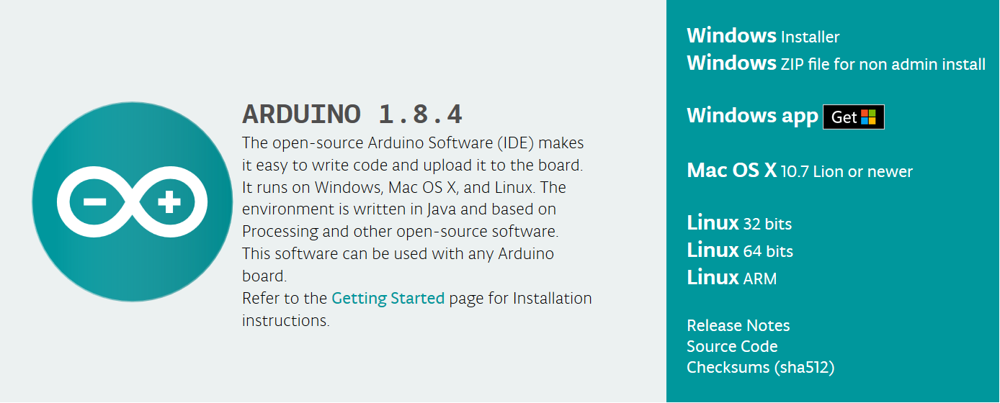

2.  After the installer have finished, we now need to install the proper
    processor core used by the Haply Development Board. Open the Arduino
    IDE, and navigate to the Boards Manager by clicking on the Tools
    menu up top and then selecting: Boards \> Boards Manger.

    **\*Note**: In the example screen shot below, support for the 32-bit
    Arduino ARM cores have already been installed, which is why the
    Board selections for Arduino Due (Programming Port) and Arduino Due
    (Native USB Port) are already available.

> 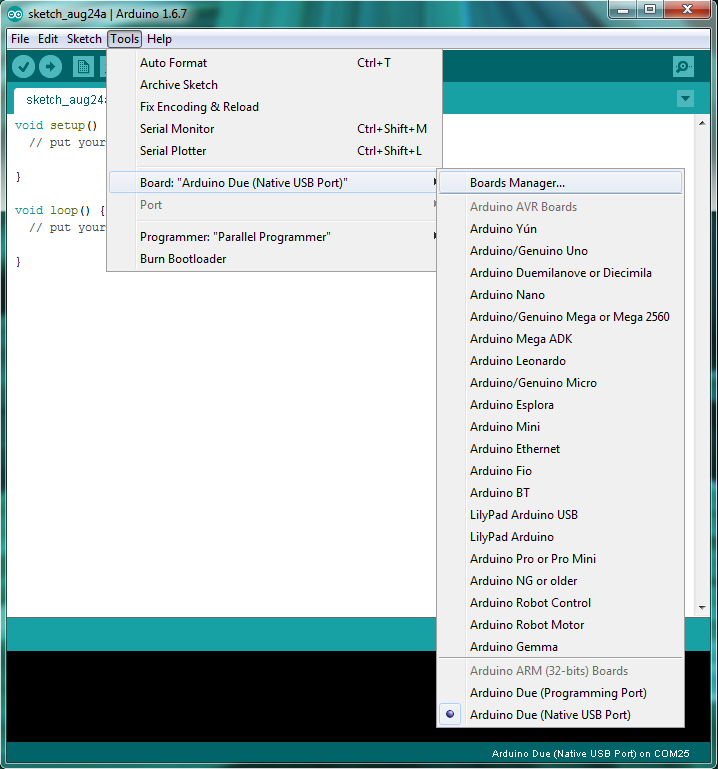
>  

1.  Once the Boards Manager window is open, select the "Arduino SAM
    Boards (32-bits ARM Cortex-M3) by Arduino" option. In the "Select
    version" drop-down menu, choose version 1.6.11 and then click
    install. Once installation is finished, your Boards Manager window
    should look similar to the screen-shot below.

    **\*Note**: This step may be skipped for Mac users

    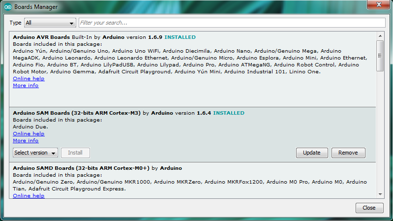

2.  After installing the Arduino IDE and setting up the Arduino SAM
    Boards core support, you can now connect your Haply Development
    Board to the computer using the micro USB cable using the available
    Native USB port available on the Board.

    **\*Note**: For Windows users, connect your Haply Development to the
    computer using the micro USB cable and proceed to Windows Driver
    Installation.

### Windows Driver Installation (Not needed for Windows 10)
----------------------------

1.  After completion of the General Steps on installing the Arduino IDE,
    setting up the support for the Arduino SAM Boards core, and
    connecting the Haply Development Board to the computer using the
    micro USB cable. Open Device Manager on your version of Windows.

2.  In Device Manager, look for the listing "Ports (COM & LPT)" and
    expand the listing. Depending on varying configurations, you will
    see "Bossa Programming Port" or "Unknown Device" or something
    similar. In the screen-shot below, the driver has already been
    installed, which is why the listing shows up as "Arduino Due
    (COM18)"

    **\*Note**: It is assumed that you only have one Serial port device
    connected to your computer, the Haply Development Board during the
    driver installation.

    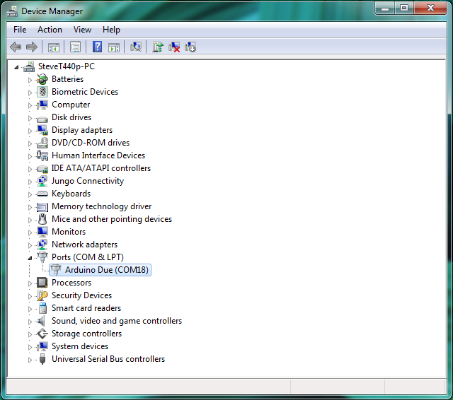

3.  Right click on the listing and select "Update Driver Software"

    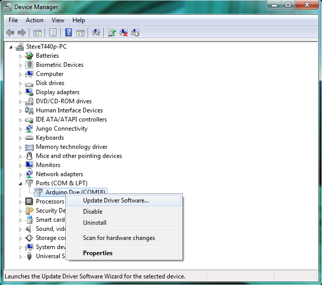

4.  This will open the "Update Driver Software" window, click the option
    "Browse my computer for driver software."

    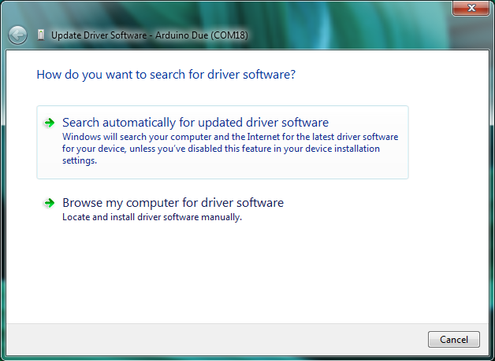

5.  This will bring you to a new window where you can select a specific
    directory for installation. Click the "Browse" button and navigate
    to the directory where the Arduino IDE is installed and locate the
    "drivers" folder. If you performed the default installation, the
    directory listing should be similar to: C:\\Program Files
    (x86)\\Arduino\\drivers. Once the directory location has been
    specified, press the "Next" button to continue. If you are prompted
    with a warning dialog about the software not passing Windows Logo
    test click "Continue Anyway" option.

    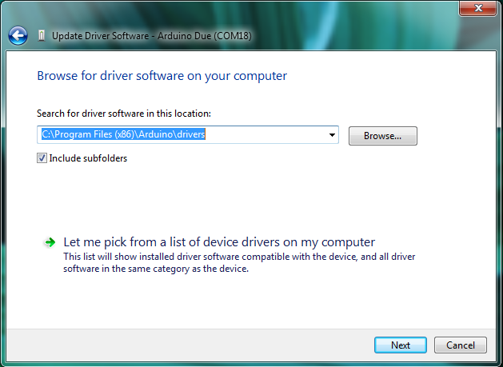

6.  Once the drivers have finished installing, you should now see the
    listing in "Ports (COM & LPT)" be displayed similar to "Arduino Due
    (COM18)." The COM numbers will change depending on the number of
    Serial devices that had been connected to your computer previously.

# Installing the Processing IDE

This manual provides a step-by-step guide on installing the Processing
IDE and all support libraries needed to run a haptic simulation in the
Processing Environment.

1.  Download and install the Processing IDE from the main Processing
    download site: <https://processing.org/download/> for your specific
    system.

    **\*Note**: Processing is built on top of Java, please ensure the
    bit-version of Processing that you are downloading for your system
    matches the version of Java you have installed on your machine. If
    you have a 32-bit version of Java installed, please download and use
    the appropriate 32-bit version of Processing. If you have a 64-bit
    version of Java installed match it with the appropriate 64-bit
    version of Processing. Not doing so will result in simulation slow
    down's and add to instabilities.

    

2.  Once installation has finished please open the Processing IDE.

# Arduino Firmware

1.  We will first load the Arduino firmware onto the Haply
    microcontroller board. The firmware interprets commands sent from
    the virtual environment on the computer, specifically motor torque
    outputs, while simultaneously updating the virtual environment on
    the current state of the device.

2.  Start by plugging in the power supply and connecting the Haply board
    to the computer through the Arduino Native port using a micro-USB
    cable.

3.  Open the Arduino sketch containing the appropriate firmware for your      board.  After the
    sketch is open in the Arduino IDE, select the 'Tools' tab at the top
    and then select the 'Board' option. Choose the option 'Arduino Due
    (Native USB Port)' as seen below:

    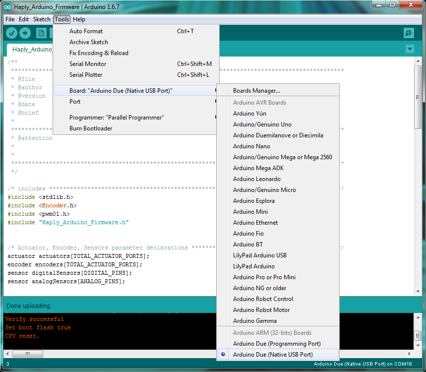

4.  Next we will specify the port selection so that the Arduino IDE
    knows which port the Haply Board uses to connect to the computer.
    Select the 'Tools' tab at the top and then select the 'Port' option.
    Choose the Port connection option for your Haply Board. Here are
    some examples of Port options you will see for different operating
    systems:

    Windows: "COM10"

    Linux: "/dev/ttyUSB0"

    Mac: "/dev/cu.usbmodem1411"

    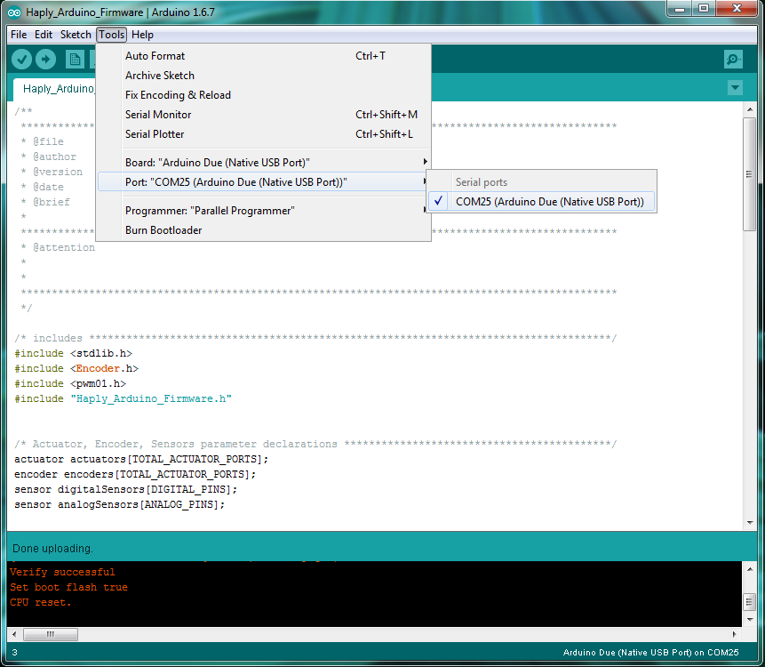

5.  Finally, we are ready to upload the Haply firmware onto the Haply
    Board. Press the upload button near the top. This will compile the
    Arduino program and upload the compiled software onto the Haply
    Board. Once the upload is finished you should see the following
    confirmation screen stating that the upload was successful:

    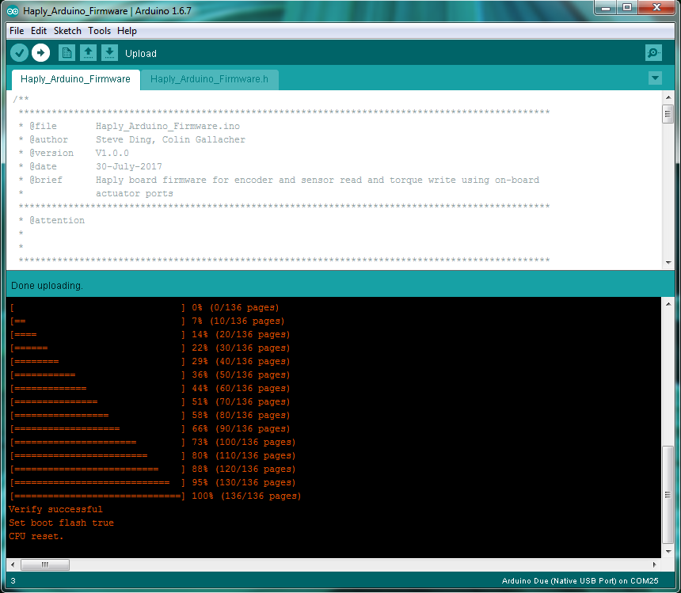

Processing Sketch
=================

1.  Open up a .pde Processing sketch file from one of the Example projects in the Java repository. Before starting an example, you may
    need to explicitly specify the Serial USB port that is being used.
    In the 'setup' portion of the sketch file, find the line defining a
    new instance of the board object:

    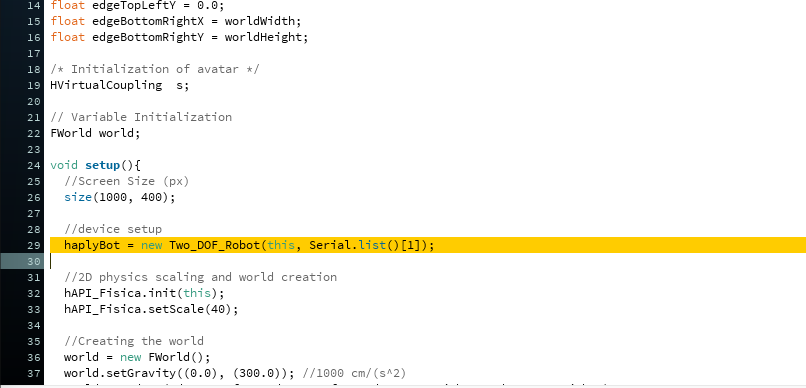

2.  Change the board declaration to the specific Serial USB port used by
    the Haply Board as determined from the previous section. For
    different operating systems, this will look something like:

    Windows: haplyBoard = new Board(this, "COM10", 0);

    Linux: haplyBoard = new Board(this, "/dev/ttyUSB0", 0);

    Mac: haplyBoard = new Board(this, "/dev/cu.usbmodem1411", 0);

    To know which port to select, or which number to place in Serial.list()[x] where x is the port declaration, you can run the following line of code to have all possible ports print into the console. Remember that when selecting the port, that counting begins at 0.

    println(Serial.list());

Haptic Simulation
=================

1.  Once the Arduino Firmware has been loaded onto the Haply Board, and
    the needed Serial USB port change has been made to the Processing
    sketch, you are ready to start the Haptic Simulation. Before
    starting, make sure the Haply device is in the initial starting
    position:

    

2.  Now click the Run button on the Processing sketch to start the
    haptic simulation. In this example we are running a basic virtual
    wall simulation (Hello Wall):

    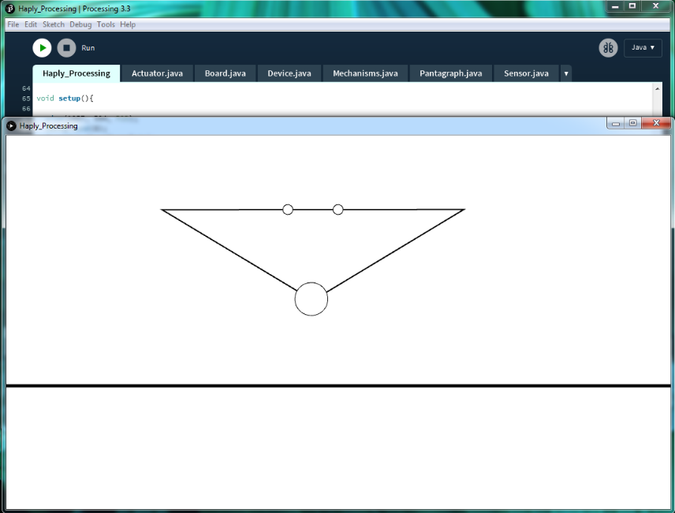

			The Haply project is intended to provide novice designers and developers
			a platform from which to explore the field of haptics. The Haptics Application
			Programming Interface (hAPI) is a modular tool that lets users quickly assemble
			a variety of haptic robots, ranging from one to four degrees of freedom, using
			the same set of hardware and programming tools. We hope people will be inspired
			to build new tools to interface with the hAPI and share them with the community.

			If you have any questions or concerns please contact us at haplyrobotics@gmail.com

			Enjoy!

			Copyright (C) <2017>  <The Haply Project: Colin Gallacher & Steven Ding>

			This program is free software: you can redistribute it and/or modify
			it under the terms of the GNU General Public License as published by
			the Free Software Foundation, either version 3 of the License, or
			(at your option) any later version.

			This program is distributed in the hope that it will be useful,
			but WITHOUT ANY WARRANTY; without even the implied warranty of
			MERCHANTABILITY or FITNESS FOR A PARTICULAR PURPOSE.  See the
			GNU General Public License for more details.

			You should have received a copy of the GNU General Public License
			along with this program.  If not, see <http://www.gnu.org/licenses/>.
