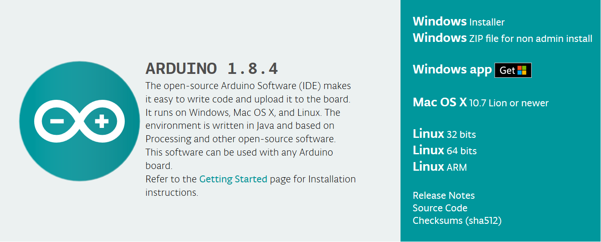
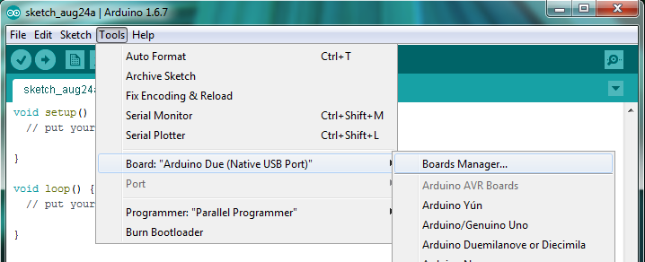
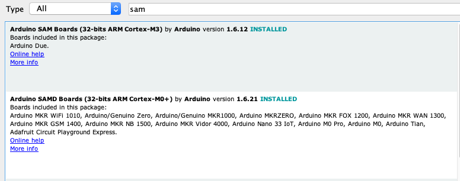
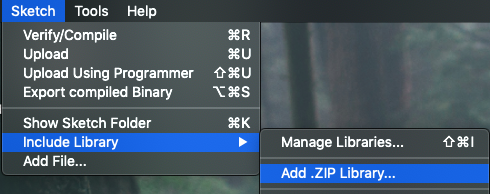
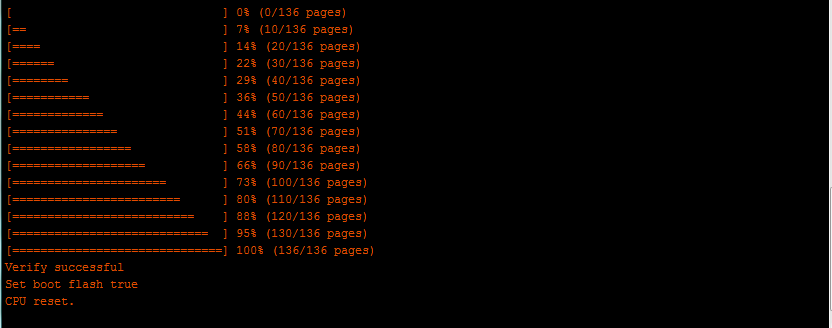
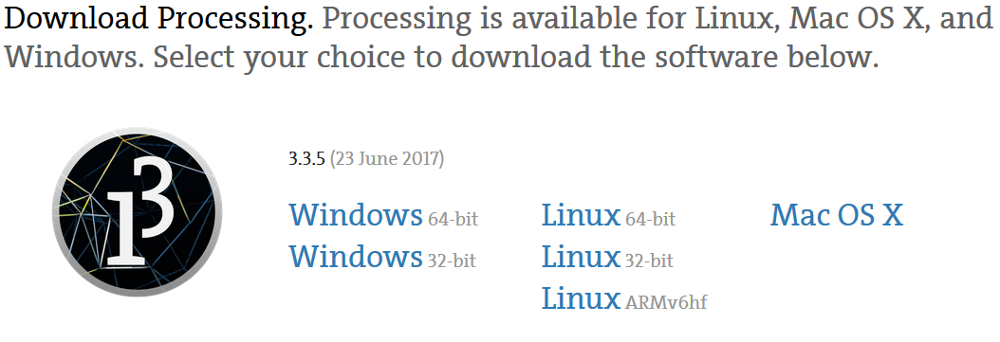

# Haply Software Setup

## Introduction
Here we'll take you through the software that you'll use with the Haply Development Kit. There are two primary softwares we'll be using in this demo -

- Arduino IDE - Integrated Development Environment used for managing firmware
- Processing - An Open-Source Graphical Library for creating haptic sketches alongside the Haply Java API

## Arduino IDE Installation

1.  Download and install the Arduino IDE from the main Arduino software
    site: <https://www.arduino.cc/en/Main/Software>. For Windows users, installation is easiest and quickest using the Windows Installer option. For other OS users, download the relevant version for your computer.

2.  After the install is complete, we now need to install the proper
    processor core used by the Haply Board. Open the Arduino
    IDE, and navigate to the Boards Manager by clicking on the Tools
    menu up top and then selecting: Boards \> Boards Manger.

3.  In the Boards Manager, search for "Arduino SAM Boards". In the "Select version" drop-down menu, choose version 1.6.12 and then click install. Do the same in a search for "Arduino SAMD Boards" and version 1.6.21. Note that these aren't the latest versions of the package.

4.  The only other thing we'll need to add to the IDE are the Encoder and PWM libraries. To save you in your search for these libraries, we've added them in [here](./libraries). Download both the PWM and Encoder libraries to your computer. Then, navigate to "Add .Zip Library" in the Sketch menu to include these libraries.

*(If you're curious about what these libraries do, you can read up on [encoders](https://howtomechatronics.com/tutorials/arduino/rotary-encoder-works-use-arduino/) and [PWM](https://www.kompulsa.com/introduction-pwm-pulse-width-modulation-works/) to learn more.)*

5.  After these steps, you can now connect your Haply Development
    Board to the computer using the micro USB cable and the available
    Native USB port available on the Board. Upon plugging in the board, you should see an indication that a board is attached in the tools menu dropdown - something like the image below.

   Depending on your OS, the ports are named differently -
   Windows: "COM10"  
   Linux: "/dev/ttyUSB0"  
   Mac: "/dev/cu.usbmodem1411"  

6. Now let's upload, or flash, the Haply firmware onto the board. See below for which firmware to download, based on the board you have.  
  Haply M0 - Firmware V0_3  
  Haply M3 - Firmware V1_5  
  Haply Modular Haptic Development Kit - Firmware V0.4  

  [Here's a link to our repository containing the firmware](https://github.com/HaplyHaptics/Haply-Arduino-Firmware-Versions). Note that when you download a firmware folder, you'll see a .ino file, as well as some .h files. These are important for uploading the firmware to your board; don't worry about moving any of these files around when you're flashing the firmware. Simply open the .ino file and click upload. See below for an example with the M0 firmware.

  

7. After the firmware is uploaded, you should see something like this in your Arduino output console.

    

# Installing the Processing IDE

Now that the Arduino IDE is all setup and the firmware we need is on our board, lets move on to Processing.

1.  Download and install the Processing IDE from the main Processing
    download site: <https://processing.org/download/> for your specific
    system. If you run a 32 or 64-bit machine, it is important that you download the respective version of the software.

    

# Summary

And that's it! By the end of going through this document, you'll have the Arduino IDE up and running, the firmware flashed to your board, and have downloaded the Processing IDE.

In the next part of Getting Started, we'll use the flashed board alongside Processing to run our first haptic demo!

			The Haply project is intended to provide novice designers and developers
			a platform from which to explore the field of haptics. The Haptics Application
			Programming Interface (hAPI) is a modular tool that lets users quickly assemble
			a variety of haptic robots, ranging from one to four degrees of freedom, using
			the same set of hardware and programming tools. We hope people will be inspired
			to build new tools to interface with the hAPI and share them with the community.

			If you have any questions or concerns please contact us at haplyrobotics@gmail.com

			Enjoy!

			Copyright (C) <2017>  <The Haply Project: Colin Gallacher & Steven Ding>

			This program is free software: you can redistribute it and/or modify
			it under the terms of the GNU General Public License as published by
			the Free Software Foundation, either version 3 of the License, or
			(at your option) any later version.

			This program is distributed in the hope that it will be useful,
			but WITHOUT ANY WARRANTY; without even the implied warranty of
			MERCHANTABILITY or FITNESS FOR A PARTICULAR PURPOSE.  See the
			GNU General Public License for more details.

			You should have received a copy of the GNU General Public License
			along with this program.  If not, see <http://www.gnu.org/licenses/>.
