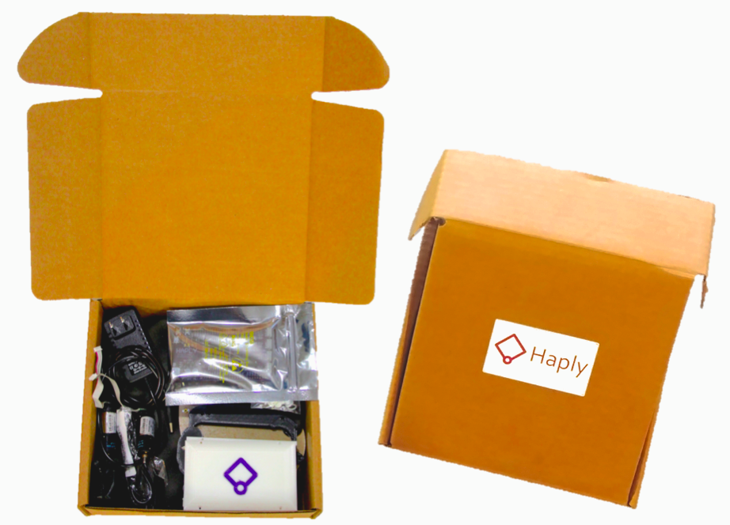

# The Haply Development Kit

## Introduction

The Haply development kit is a robust and adaptable open-source hardware
development platform for haptic applications. Designed to be accessible
to novices and experts alike, the kit allows you to quickly setup and
interact with a haptic simulation using a 2-degree-of-freedom pantograph
device.

Visit [www.haply.co](http://www.haply.co) for more information

## Kit Overview

The Haply development kit contains all the mechanical and electrical
components needed to construct your own 2-degree-of-freedom pantograph
device.

Using the hAPI or Haply API, and with a myriad of example projects and
detailed setup tutorials available, the kit allows you to quickly start
developing your own haptic applications.

With design expansion in mind, the Haply Control Board is capable of
controlling up to up to 4 motors. Allowing experienced users to develop
their own unique designs ranging from 1-degree-of-freedom to
4-degree-of-freedom haptic devices.

## Kit Contents
   
• 1x Acrylic Plate  
• 2x Acrylic L2 Arm Linkages  
• 1x Board Case Bottom  
• 1x Board Case Top  
• 2x Development Board Extension Wires  
• 1x End Effector and Arm Assembly Screws   
• 1x Haply Control Board  
• 1x Large and Small Allen Keys  
• 2x Motors  
• 1x Power Supply  
• 1x Micro USB Cable  
• 4x Suction Cup Feet  
• 1x Wire Adapter Board  
• 1x 3D Printed Base  
• 1x 3D Printed End Effector  
• 2x 3D Printed L1 Arm Linkages  
• 1x 3D Printed Motor Housing  
• 1x 3D Printed Motor Stand  
• 1x Screw Set  

Haply Control Board (Version 0.3) 
=================================

## Overview

The Haply control board is a highly robust and configurable open-source
platform ideal for haptic and robotic development.

Based on the Arduino Due, the Haply board uses the 32-bit AT91SAM3X8E
ARM microcontroller as its core. Side rail pin connections are
maintained giving the Haply board compatibility to a majority of
available Arduino Shields.

Two L298P Motor drivers are incorporated into the board, allowing the
Haply control board the ability to precisely control up to four DC
motors.

The Haply control board is fully compatible with the Arduino IDE and
programmable through the Native USB port.

## Technical Specifications

-   Measures 100mm X 59.5mm x 8mm

-   AT91SAM3X8E 32-bit ARM MCU @84MHz

-   Native USB port for programming and debugging

-   Contains 4 motor control ports

-   3.3V operating voltage

-   5 - 12V recommended input voltage

-   2A Max output current per motor port

-   Reset and Erase Button

**Warning: MCU I/O pins have maximum tolerated voltage of 3.3V**

# Haply Dev Kit Assembly Instructions (V2.0)

## Haply Development Kit Contents  

1.   1x Power supply                 
2.   1x Micro USB cable               
3.   4x Suction cup feet             
4.   1x 3D printed motor housing     
5.   2x Motors                       
6.   1x 3D printed motor stand       
7.   1x Board Case Top              
8.   2x 3D printed L1 arm linkages   
9.   2x Acrylic L2 arm linkages      
10. Large and small Allen Keys 
11. End effector and arm assembly screws
12. 2x Dev board extension wires
13. 1x Wire adapter board 
14. 1x Acrylic plate
15. 1x Board Case Bottom
16. 1x 3D printed Base
17. 1x Haply control Board
18. 1x 3D printed end effector
19. 1x Screw Set  
        • 2x 2-56 screws (Motor stand)  &nbsp;&nbsp;&nbsp;&nbsp;&nbsp;&nbsp;&nbsp;&nbsp;&nbsp;&nbsp;&nbsp;&nbsp;&nbsp;&nbsp;&nbsp;&nbsp;&nbsp;&nbsp;  •  4x M2 screws (Motors)  
        • 3x 2-56 screws (Acrylic Plate) &nbsp;&nbsp;&nbsp;&nbsp;&nbsp;&nbsp;&nbsp;&nbsp;&nbsp;&nbsp;&nbsp;&nbsp;&nbsp;&nbsp;&nbsp;&nbsp;&nbsp;&nbsp;   • 2x 2-56 screws black (Wire adapter board)  
        • 4x 2-56 screws (Board Case)       &nbsp;&nbsp;&nbsp;&nbsp;&nbsp;&nbsp;&nbsp;&nbsp;&nbsp;&nbsp;&nbsp;&nbsp;&nbsp;&nbsp;&nbsp;&nbsp;&nbsp;&nbsp;&nbsp;  • 1x ¾" 4-40 screw (Motor stand)  
        • 2x 4-40 set screws black (Arm linkages)  

  
Device Assembly
===============

Before proceeding with the device assembly, please check over the
inventory of the kit contents from the previous section. You will need also
need a small flat head screw driver and a small Philips head (cross
head) screw driver for device assembly.

Please peel off all protective plastics on the acrylic pieces, and
attach the acrylic plate to the 1x 3D printed Base with 3x
2-56 screws using the appropriate Allen key.

***Warning: Take care not to over tighten screws**

  ------------------------------------------------------------------------------------ -----------------------------------------------------------------------------------     
  

## Part A: Motor Housing Assembly

**Section parts list:**

-   1x 3D printed motor housing
-   2x Motors
-   4x M2 screws    

1.  Insert the motors into the motor housing with the cable slipped through the gap in the housing. Make sure the motors are
    pushed all the way to the bottom.

2.  Align the holes from the motor housing with the screw holes on the
    motors and use two M2 screws to fix each motor to the motor housing using a Philips head screwdriver.
    
       

## Part B: L1 Arm Linkage Assembly

 

**Section parts List:**

-   1x Completed assembly from previous section   
-   2x 4-40 set screws 
-   2x 3D printed L1 arm linkages

1.  Insert the 4-40 set screws part way into both of the L1 arm
    linkages.

2.  Before attaching the L1 arm linkages to the motors, make sure the
    flat side of the motor shaft can be aligned with the set screw.

3.  Once the motor shafts and the set screws are aligned, attach the arm
    linkages. Ensure that arm linkages are oriented such that the cut-outs are on the inner side of the assembly with the flat side facing up.

4.  Move the arms around to ensure connection to motor shaft.

 

## Part C: Motor Stand Assembly

  
 
 **Section parts List:**   
 
 -   1x Completed assembly from previous section
 -   1x 3D printed motor stand
 -   1x Wire adapter board
 -   2x M2 screws black
 -   1x ¾" 4-40 screw

1.  Attach the motor cables into the wire adaptor board as shown.

2.  Slide the motor stand onto the assembly with the wire adaptor above

3. Insert and tighten the M2 screws into the motor housing.

   

1.  Attach the ¾" 4-40 screw in the front using the flathead screwdriver. The 4-40 screw will go through the motor stand into the small hole on the motor housing.

 

------------------------------------------------------------------------------------- -------------------------------------------------------------------------------------

## Part D: L2 Arm Linkage Assembly

 

**Section parts List:**

-   1x Completed assembly from previous section
-   2x L2 arm linkages 
-   2x Plastic joints assembly
-   1x End-effector handle assembly

1.  Place a plastic joint cap into the L1 arm linkage.

2.  Before connecting a L2 arm linkage, make sure a Teflon washer is
    sandwiched between the two linkages.

   

1.  Install the second L2 arm linkage with a Teflon washer sandwiched
    between the L1 and L2 arm linkages as pictured.

2.  Make sure the second L2 arm is installed on the opposite side
    compared to the first.
    
3. On the opposite side of the assembly, place the L1 arm under the L2 arm so that the end of one L2 arm linkage is below the other. This will allow for mounting of the end effector.

   

1.  Place the end-effector cap into the top L2 arm linkage, sandwich the
end-effector handle washer between the two L2 arm linkages and
finally screw in the end-effector screw to complete this section.

   
  
  ------------------------------------------------------------------------------------- -------------------------------------------------------------------------------------

## Part E: Base Attachment Assembly

**Section parts List:**  

-   1x Completed assembly from previous section
-   2x 2-56 screws
-   1x Acrylic top plate/ 3D printed base assembly

     

1.  Place the completed assembly into the top plate.

2.  Screw the assembly into the top plate on both sides.

 
 
 ------------------------------------------------------------------------------------

## Part F: Haply Control Board Installation 

**Section parts List:**

-   1x Completed assembly from previous section 
-   1x Haply control board  
-   2x Dev board extension wires 
-   1x Board Case Top
-   1x Board Case Bottom
-   4x 2-56 screws 

1.  Connect the dev board extension wires to the Haply control board as shown in the picture.

2. Lay the Haply control board upside down the case such that the wires extend from the open side of the case. All motor ports should be accessible.

   

1. Place and tighten the case top using the 2-56 screws

2. Attach the dev board extension wires as pictured. This will ensure correct function of the Haply software.

 
    
------------------------------------------------------------------------------------ ------------------------------------------------------------------------------------

## Part G: Base Plate Assembly

**Section parts List:**  

 -   1x Completed assembly from previous section
 -   1x Acrylic bottom plate
 -   4x Suction cup feet 

1.  Place the bottom plate and screw in each of the suction cup feet.

2.  Upon completion the device will be ready for use!

   
------------------------------------------------------------------------------------- -----------------------------------------------------------------------------------

## Part H: Connectivity Wiring

- 1x Power supply                 
- 1x Micro USB cable    

Although not a part of assembly, the power supply and micro USB cable are attached as shown below

  

------------------------------------------------------------------------------------ ------------------------------------------------------------------------------------

**The completed Haply Development Kit**

    The Haply project is intended to provide novice designers and developers 
	a platform from which to explore the field of haptics. The Haptics Application 
	Programming Interface (hAPI) is a modular tool that lets users quickly assemble 
	a variety of haptic robots, ranging from one to four degrees of freedom, using
	the same set of hardware and programming tools. We hope people will be inspired
	to build new tools to interface with the hAPI and share them with the community. 
	
	If you have any questions or concerns please contact us at haplyrobotics@gmail.com
	
	Enjoy! 
	
	
    Copyright (C) <2017>  <The Haply Project: Colin Gallacher & Steven Ding>

    This program is free software: you can redistribute it and/or modify
    it under the terms of the GNU General Public License as published by
    the Free Software Foundation, either version 3 of the License, or
    (at your option) any later version.

    This program is distributed in the hope that it will be useful,
    but WITHOUT ANY WARRANTY; without even the implied warranty of
    MERCHANTABILITY or FITNESS FOR A PARTICULAR PURPOSE.  See the
    GNU General Public License for more details.

    You should have received a copy of the GNU General Public License
    along with this program.  If not, see <http://www.gnu.org/licenses/>.
	
	

